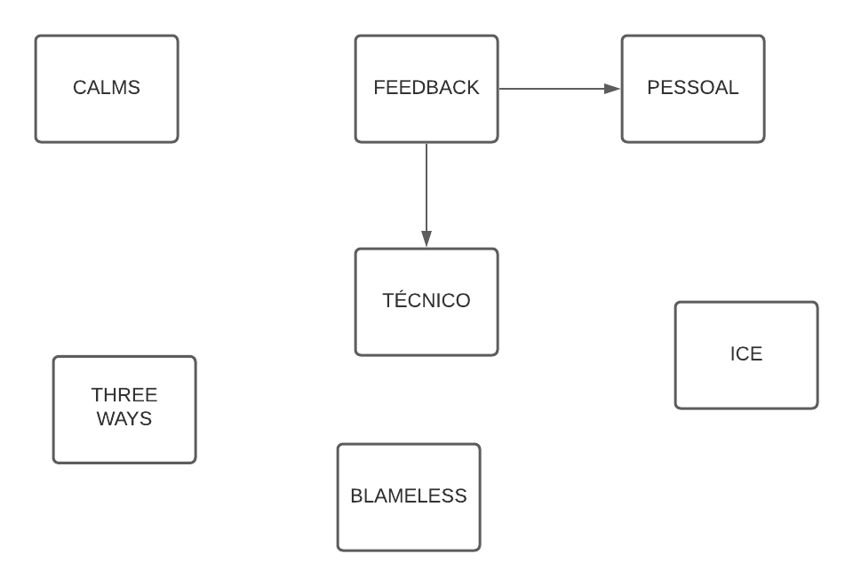

## Setup necessário para aula
Para esta aula é necessário que você tenha em seu Windows/Linux/Mac o Terraform, o kubectl e o Docker instalados.

Também é interessante ter uma conta na AWS para brincar e fazer alguns testes :)

Será maneiro você ter uma conta no GitLab também!

Tenha também o helm na sua máquina! De preferência o 3 :)

Estas documentações oficiais podem te ajudar:

https://aws.amazon.com/pt/premiumsupport/knowledge-center/create-and-activate-aws-account/
https://learn.hashicorp.com/tutorials/terraform/install-cli
https://kubernetes.io/docs/tasks/tools/
https://docs.docker.com/get-docker/
https://gitlab.com/users/sign_in
https://helm.sh/docs/intro/install/

## Material de apoio
Materiais que podem te ajudar na aula de hoje para você se aprofundar:

https://docs.gitlab.com/ee/user/project/integrations/prometheus_library/kubernetes.html
https://k21academy.com/docker-kubernetes/prometheus-grafana-monitoring/
https://roadmap.sh/devops
https://www.linuxtips.io/pages/cheatsheet
https://prometheus.io/docs/alerting/latest/alertmanager/
https://docs.gitlab.com/ee/user/project/integrations/prometheus.html
https://docs.gitlab.com/ee/user/clusters/applications.html
https://prometheus.io/docs/prometheus/latest/querying/basics/
https://github.com/kubernetes/kube-state-metrics
https://github.com/kubernetes/kube-state-metrics/blob/master/docs/pod-metrics.md
https://www.splunk.com/en_us/data-insider/what-is-observability.html#:~:text=Observability%20is%20the%20ability%20to,from%20outputs%2C%20namely%20sensor%20data.
https://github.com/badtuxx/DescomplicandoHelm
https://aws.amazon.com/pt/elasticloadbalancing/pricing/
https://github.com/badtuxx/k8s-canary-deploy-example
https://github.com/kubernetes/kube-state-metrics/tree/master/examples
https://itrevolution.com/the-three-ways-principles-underpinning-devops/
http://radar.oreilly.com/2015/01/devops-keeps-it-cool-with-ice.html
https://www.fernandoike.com/pt/2017/08/21/blameless-a-culpa-nao-e-sua/
https://12factor.net/

##### PESSOAS DA COMUNIDADE PARA ACOMPANHAR

https://www.twitch.tv/moniquelive # go
https://devsres.com/marcelo/en/ # devops em geral
https://www.twitch.tv/masbahnana # redes, infra, ansible
https://gomex.me/ # devops em geral
https://sysadminas.com.br/ # devops em geral
http://ellenkorbes.com/ # go, kubernetes
https://twitter.com/SamuelCavallie1 # jedi devops
https://afropython.org/ # conteúdos de devops na comunidade
https://devopsdays.org/ # eventos de devops
https://www.youtube.com/watch?v=jZeJmYLydBU&t=1561s # processos seletivos de devops
https://www.youtube.com/c/PunkdoDevOps/ # meu canal no youtube
https://twitch.tv/punkdodevops # canal na twitch
https://twitter.com/sra_allmeida # devops em geral
https://twitter.com/fidelissauro # devops em geral
https://github.com/mauriciopgomes # devops em geral
https://www.meetup.com/pt-BR/Docker-Rio-de-Janeiro/ # meetup que coordeno